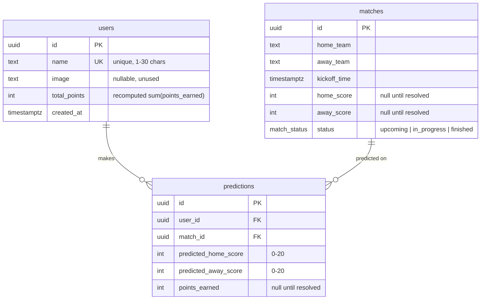
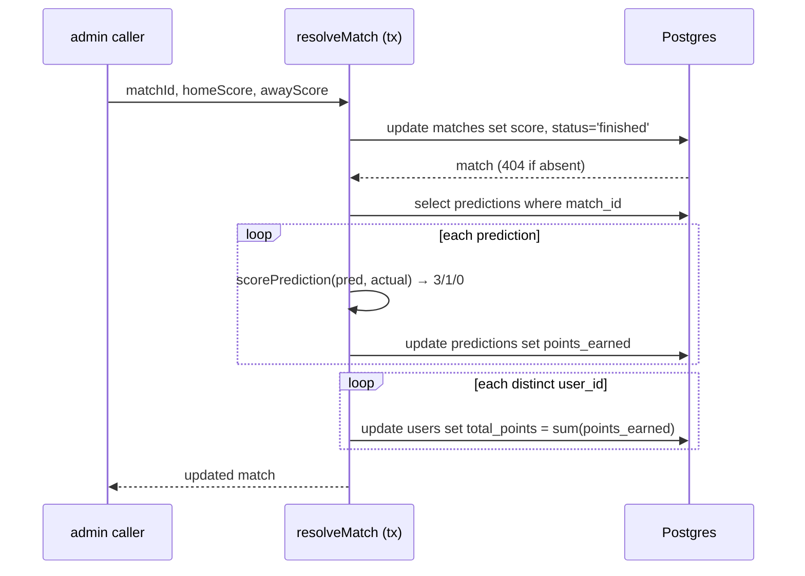

# CupClash — design

Score-prediction game: name-only login, predict exact scores before kickoff, 3/1/0 points, leaderboard.

## Schema

- `predictions` has `UNIQUE (user_id, match_id)` — one prediction per user per match; POST upserts on that key.
- `match_status` is a Postgres enum (`upcoming`, `in_progress`, `finished`).
- `total_points` is denormalized: recomputed as `sum(points_earned)` inside the resolve transaction, so it can never drift from the prediction rows.

## Scoring + lock rules

`lib/scoring.ts`:

| Prediction vs result | Points |
|---|---|
| Exact score (both numbers match) | 3 |
| Same outcome only (home win / draw / away win) | 1 |
| Wrong outcome | 0 |

Lock rule: `isLocked(kickoffTime)` = `now >= kickoff_time`. `POST /api/predictions` returns **409** once locked. Until then, re-posting edits the same row (upsert) — users can change their pick freely before kickoff.

## Resolution flow

`POST /api/admin/resolve-match` → `resolveMatch(matchId, home, away)` in `lib/resolve.ts`, one DB transaction:

Idempotent by design: re-resolving recomputes `points_earned` and `total_points` from scratch, so a corrected score just rewrites the totals. No admin auth on the route — it's trusted-caller only (same trust ceiling as identity below).

## Identity model + trust ceiling

- `POST /api/users` with `{ name }` upserts a user row by unique name and returns `{ id, name }`. No password, no email, no session token.
- Client stores `{ id, name }` in zustand (`persist` → localStorage key `cupclash-user`) and sends `x-user-id: <uuid>` on every request via a ky `beforeRequest` hook.
- Server: `requireUser(req)` validates the header is a uuid and loads the user row; missing/unknown → 401.
- **Trust ceiling**: anyone who knows a user's uuid can act as them. This is deliberate — the app is a casual game, not a bank. Consequences:
  - Never store anything sensitive on the user row.
  - Don't add features where impersonation matters (payments, private leagues with stakes) without a real auth upgrade.
  - The admin resolve route is unauthenticated — it relies on the same "trusted environment" assumption; gate it before exposing publicly.

## API surface

| Method | Path | Auth | Purpose |
|---|---|---|---|
| POST | `/api/users` | — | Name login/upsert → `{ id, name }` |
| GET | `/api/matches?status=` | optional `x-user-id` | Match list; joins caller's prediction when header present |
| POST | `/api/predictions` | `x-user-id` | Upsert prediction; 404 match, 409 locked |
| GET | `/api/leaderboard` | — | Users by `total_points` desc, name asc |
| POST | `/api/admin/resolve-match` | trusted | Set final score + score all predictions |
| GET | `/api/openapi.json` | — | Hand-written spec (`lib/openapi.ts`) |
| GET | `/api/docs` | — | Scalar UI over the spec |

Full request/response shapes: `docs/API.md` or `/api/docs` interactively.

## Frontend data flow

- ky instance (`lib/api-client.ts`): `prefixUrl /api` + hook injecting `x-user-id` from `useUserStore`.
- TanStack Query keys:
  - `['matches', status]` — match list per status tab (`all|upcoming|in_progress|finished`, zustand `useFilterStore`)
  - `['leaderboard']` — leaderboard page
- **Optimistic update** (`components/prediction-form.tsx`): `onMutate` cancels `['matches']` queries, snapshots all cached match lists, writes the new prediction into the matching card; `onError` restores snapshots + error toast; `onSettled` invalidates `['matches']` to resync.
- Login (`components/name-dialog.tsx`): modal blocks until a name is submitted → POST `/api/users` → store user → invalidate `['matches']` so predictions join under the new identity.
- Pages are client components (`'use client'`); all data flows through TanStack Query — no server components fetching, no SSR data.

## Observability

- **pino** (`lib/logger.ts`): JSON logs; `pino-pretty` transport in development, `LOG_LEVEL` env override. Logged events: user login, prediction saved, match resolved — each with `userId`/`matchId` fields.
- **OpenTelemetry** (`instrumentation.ts`): `registerOTel({ serviceName: 'cupclash' })` via `@vercel/otel` — auto-instruments Next.js requests when deployed on Vercel.
- No metrics/alerts layer — pino + OTel traces are the whole observability story for now.
